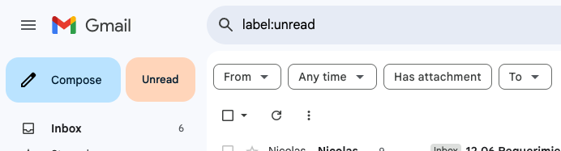

# Gmail Unread Button

This is a Chrome extension that injects "Unread" button into Gmail that redirects to the unread inbox.

## Installation

1. Open the Chrome extensions page by navigating to `chrome://extensions/`
2. Enable developer mode
3. Click "Load unpacked" and select this folder
4. Reload Gmail tab
5. Click the "Unread" button to go to the unread inbox
